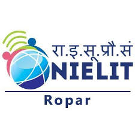

# AIML Batch Jan 2026 | NIELIT Ropar

A modern, interactive web portfolio showcasing the **AIML Batch January 2026** cohort at NIELIT Ropar.

## Features

- **Hero Section** - Eye-catching landing page with NIELIT branding and batch overview
- **Student Profiles** - Interactive 3D flip cards displaying student information with hover effects
- **Curriculum Timeline** - 6-month training program structure with neural network visualization
- **Statistics Dashboard** - Key metrics (Students, Specializations, etc.)
- **Responsive Design** - Fully optimized for desktop and mobile devices
- **Modern UI** - Glassmorphism effects, gradients, and smooth animations

## Technology Stack

- **HTML5** - Semantic markup
- **CSS3** - Animations, gradients, glassmorphism
- **JavaScript** - Interactive features and animations
- **Canvas API** - Neural network visualization

## Contact & Credits

**Institution**: NIELIT Ropar  
**Batch**: AI/ML JAN 2026  
**Year**: 2026
